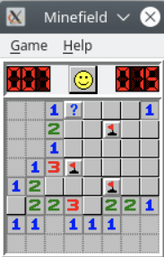
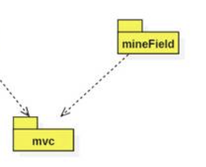

# Mine Field Game
_A Java OOD (Object Oriented Design) Project_

> This project is an implementation of MVC design pattern in java.

### __Idea__
Mine field is a popular game across computers and parties. This project is to build a java program that has mine field game features which based on an exsisting mvc framework. 

Although, the game itself has unique functionalities that needs to further design and program, all features are implement or 'uses' the mvc framework. Which is also the purpose for this project - implementing specific featrues by a given framework.

### __Design__ 
By the rules of the game, player sponse at the left corner of the panel. One can decide to move forward to any avalivable direction. If the step is not on a mine, on adjacent grids, display number of mines around this location. Or else, the player steps on a mine, game over.

### __Implementation__

__mvc package__
contains basic mvc framework implementation including panel layout, app factory, and model.

__minefield package__
implements mvc with customized functionalities:
- initialize mines across the field panel
- directional buttons on the control panel
- surrounding mine alert feature
- game rules

### __Testing__
